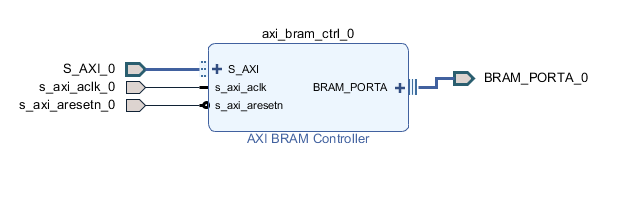

# AXI-4 lite

The AXI4-Lite bus interface consists of five channels: Read Address, Read Data, Write Address, Write Data, and Write Response. An AXI4 read transaction using the Read Address and Data channels is shown in [figure 1.](https://www.realdigital.org/img/cede9613613d73fe3cf53fde7c215b73.png) Similarly an AXI4 write transaction using the Write Address, Data, and Response channels is shown in [figure 2.](https://www.realdigital.org/img/01b29efbcdc24d7feadbbb7c33cab5c5.png) 

## AXI read transaction
The read transaction is initiated by the master to retrieve values from the slave device. This transaction is completed based on the read address and the read data channels. The read address channel carries the address information and some handshaking signals that allows the master to inititate a read transaction. The read data channel carries the actual data values that are transferred, together with the associated handshaking signals.

 

 

## AXI write transaction
The write transaction is initiated by the master to write (store) data values in the slave device. This transaction is completed based on the write address, write data and write response channels. The write address channel carries the address information and some handshaking signals that allows the master to inititate a write transaction. It is identical to the read address channel above. The write data channel carries the actual data values that are to be written, together with the associated handshaking signals. The write response channel allows the slave to acknowledge receipt of data

This AXI4-lite version supports a BRAM controller,The AXI master is customized according to the builtin IP of BRAM controller.

